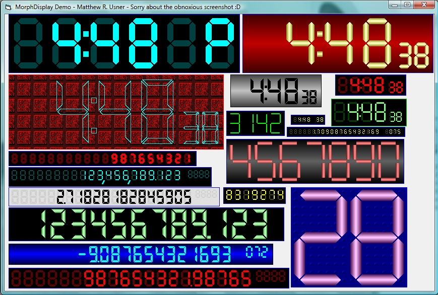



## MorphDisplay v1\.11 \- LED / LCD Digital Display Control

### Description

(29 Apr 2007 - Minor tweaks; removed MatrixDisplay control for later repost) An ownerdrawn digital display usercontrol that uses shaped regions to form hexagonal, trapezoidal or rectangular LED/LCD digit segments. Control can be used for calculator displays, displaying time, or as a simple counter. Just about every conceivable aspect of this control can be customized via a multitude of properties. Main and exponent digits are separately configurable. Properties for segment height and width, intersegment gap, and interdigit gap allow you to size, position and space digits exactly the way you want. Support for thousands and decimal separators. Thousands and decimal separators can be defined as a comma or period so that international standards can be maintained. Thousands grouping can also be adjusted according to international preference. Background can be gradient or bitmap. Background bitmap can be tiled or stretched. All colors are also fully user-definable. Negative numbers can be displayed in a different color than positive. Digit segments can have a 3D gradient added to them if desired. Corners can be individually rounded for a different look. A simulated digit burn-in display mode is also available if desired. A Filament option allows digits to be displayed as wireframed, rather than solid. Exponent display can be disabled if you wish to use this as a simple counter. Six basic themes are included that show various display styles. Since there's ~40 properties that make up one theme, it is a very good idea to make a theme out of a combination of properties that works well in a particular application. Inspired by LaVolpe's "Shaped Regions" project at txtCodeId=58562. As always, constructive feedback is welcome, and votes are always appreciated.
 
### More Info
 

             |
---                |---
**Submitted On**   |2007-04-29 17:20:28
**By**             |[Option Explicit](https://github.com/Planet-Source-Code/PSCIndex/blob/master/ByAuthor/option-explicit.md)
**Level**          |Intermediate
**User Rating**    |5.0 (230 globes from 46 users)
**Compatibility**  |VB 6\.0
**Category**       |[Custom Controls/ Forms/  Menus](https://github.com/Planet-Source-Code/PSCIndex/blob/master/ByCategory/custom-controls-forms-menus__1-4.md)
**World**          |[Visual Basic](https://github.com/Planet-Source-Code/PSCIndex/blob/master/ByWorld/visual-basic.md)
**Archive File**   |[MorphDispl2063034292007\.zip](https://github.com/Planet-Source-Code/option-explicit-morphdisplay-v1-11-led-lcd-digital-display-control__1-64204/archive/master.zip)

### API Declarations

Many.

